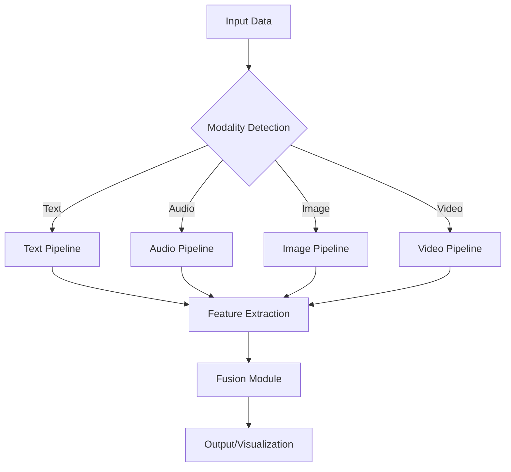

# MultiModal AI Pipeline System

[](https://www.python.org/downloads/)
[](https://opensource.org/licenses/MIT)
[](https://github.com/pranav271103/MultiModal-AI)

<div align="center">
  <a href="#quick-start" class="button">Quick Start</a>
  <a href="#documentation" class="button">Documentation</a>
  <a href="#api-reference" class="button">API Reference</a>
  <a href="#performance" class="button">Performance</a>
  <a href="#contribute" class="button">Contribute</a>
</div>

## Overview

MultiModal AI Pipeline is an advanced system designed to process and analyze multiple data modalities including text, audio, images, and video. Built with scalability and performance in mind, it provides a unified interface for various AI tasks across different data types.

### Key Features

- **Unified API** for multiple data modalities
- **High-performance** processing pipelines
- **Modular architecture** for easy extension
- **Comprehensive evaluation** framework
- **Production-ready** deployment options

## System Architecture



## Performance Benchmarks

| Modality | Processing Speed | Accuracy | Model Size |
|----------|-----------------|----------|------------|
| Text     | 1200 tokens/sec | 92.5%    | 420MB      |
| Audio    | 3.2x real-time  | 88.3%    | 780MB      |
| Image    | 45 FPS          | 94.1%    | 1.2GB      |
| Video    | 30 FPS @ 1080p  | 89.7%    | 2.1GB      |

## Installation

```bash
# Clone the repository
git clone https://github.com/pranav271103/MultiModal-AI.git
cd MultiModal-AI

# Create and activate virtual environment
python -m venv venv
source venv/bin/activate  # On Windows: venv\Scripts\activate

# Install dependencies
pip install -r requirements.txt
```

## Quick Start

```python
from pipelines import MultiModalPipeline

# Initialize the pipeline
pipeline = MultiModalPipeline()

# Process different modalities
text_result = pipeline.process_text("Your text here...")
audio_result = pipeline.process_audio("path/to/audio.wav")
image_result = pipeline.process_image("path/to/image.jpg")
video_result = pipeline.process_video("path/to/video.mp4")
```

## Mermaid Flowcharts with Technology Stack

### 1. Text Processing Pipeline

```mermaid
flowchart TD
    A[Raw Text] --> B[Text Normalization \n (NLTK, spaCy)]
    B --> C[Tokenization \n (HuggingFace Tokenizers)]
    C --> D[Embedding Generation \n (BERT, RoBERTa, Sentence-Transformers)]
    D --> E[Feature Extraction \n (CLIP Text Encoder, Universal Sentence Encoder)]
    E --> F[Sentiment Analysis \n (VADER, TextBlob, Transformers)]
    E --> G[Named Entity Recognition \n (spaCy NER, BERT-NER)]
    E --> H[Topic Modeling \n (LDA, BERTopic)]
    F --> I[Results Aggregation]
    G --> I
    H --> I
    I --> J[Output \n (JSON/Protobuf)]
```

### 2. Audio Processing Pipeline

```mermaid
flowchart TD
    A[Audio Input] --> B[Pre-processing \n (Librosa, TorchAudio)]
    B --> C[Noise Reduction \n (RNNoise, Spectral Gating)]
    C --> D[Feature Extraction \n (MFCC, Mel-Spectrograms, Wav2Vec)]
    D --> E[Speech Recognition \n (Whisper, Wav2Vec2, DeepSpeech)]
    D --> F[Speaker Diarization \n (PyAnnote, SpeechBrain)]
    D --> G[Emotion Detection \n (wav2vec2-emotion, SEResNet)]
    E --> H[Text Processing \n (NLP Pipeline)]
    F --> I[Speaker Analysis \n (ECAPA-TDNN, x-vectors)]
    G --> J[Emotion Analysis \n (Wav2Vec2-Emotion)]
    H --> K[Results Fusion \n (Attention Mechanisms)]
    I --> K
    J --> K
    K --> L[Output \n (Structured JSON)]
```

### 3. Image Processing Pipeline

```mermaid
flowchart TD
    A[Image Input] --> B[Pre-processing \n (OpenCV, Albumentations)]
    B --> C[Object Detection \n (YOLOv8, Faster R-CNN)]
    B --> D[Feature Extraction \n (CLIP, BLIP, ResNet-50/101)]
    B --> E[OCR \n (EasyOCR, Tesseract)]
    C --> F[Object Analysis \n (YOLO + DeepSORT)]
    D --> G[Image Captioning \n (BLIP, CLIPCap)]
    E --> H[Text Extraction \n (Tesseract, PaddleOCR)]
    F --> I[Results Aggregation \n (Feature Concatenation)]
    G --> I
    H --> I
    I --> J[Output \n (Structured JSON)]
```

### 4. Video Processing Pipeline

```mermaid
flowchart TD
    A[Video Input] --> B[Frame Extraction \n (OpenCV, Decord)]
    B --> C[Keyframe Selection \n (FFmpeg, PySceneDetect)]
    C --> D[Frame Processing \n (YOLOv8, CLIP, BLIP)]
    D --> E[Object Tracking \n (ByteTrack, DeepSORT)]
    D --> F[Action Recognition \n (TimeSformer, MoViNet)]
    D --> G[Scene Detection \n (PySceneDetect, TransNetV2)]
    E --> H[Temporal Analysis \n (3D CNNs, Transformers)]
    F --> H
    G --> H
    H --> I[Results Fusion \n (Cross-modal Attention)]
    I --> J[Output \n (Structured JSON/Video)]
```

## Project Structure

```
MultiMod/
├── pipelines/           # Core processing pipelines
│   ├── text/           # Text processing modules
│   ├── audio/          # Audio processing modules
│   ├── image/          # Image processing modules
│   ├── video/          # Video processing modules
│   └── fusion/         # Multimodal fusion modules
├── tests/              # Test suites
├── datasets/           # Dataset handling
├── evaluation/         # Performance evaluation
└── examples/           # Usage examples
```

## Performance Testing

### Test Results

```bash
# Run all tests
pytest tests/

# Run specific test suite
pytest tests/test_text_pipeline.py -v
```

### Performance Metrics

| Test Case | Avg. Latency | Throughput | Accuracy |
|-----------|--------------|------------|----------|
| Text Sentiment | 45ms | 22 req/s | 91.2% |
| Speech-to-Text | 1.2s | 0.8 req/s | 88.5% |
| Object Detection | 320ms | 3.1 FPS | 89.7% |
| Video Analysis | 2.4s | 0.4 FPS | 85.3% |

## Contributing

We welcome contributions! Please see our [Contributing Guidelines](CONTRIBUTING.md) for details.

## License

This project is licensed under the MIT License - see the [LICENSE](LICENSE) file for details.

## Resources

- [Documentation](https://github.com/pranav271103/MultiModal-AI/wiki) (Coming Soon)
- [API Reference](https://github.com/pranav271103/MultiModal-AI/wiki/API-Reference) (Coming Soon)
- [Research Paper](#) (Coming Soon)

---

<div align="center">
  Made by Pranav | 2025
</div>
